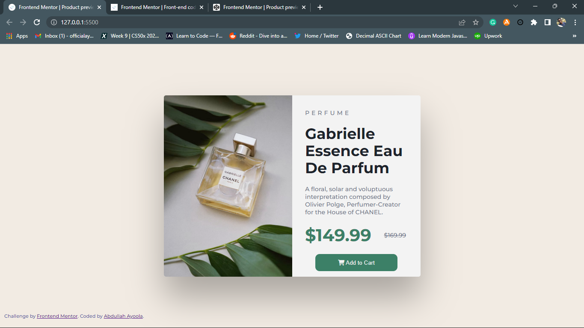
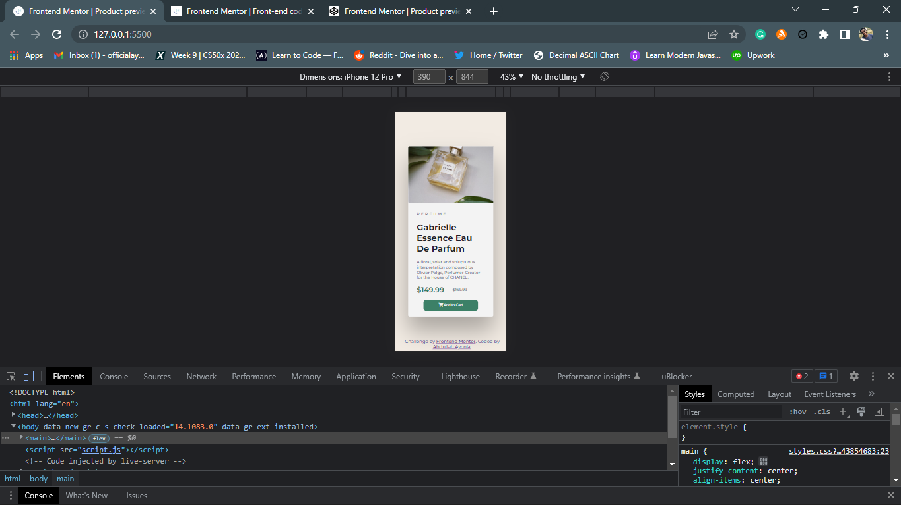

# Frontend Mentor - Product preview card component

This is a solution to the [Product preview card component challenge on Frontend Mentor](https://www.frontendmentor.io/challenges/product-preview-card-component-GO7UmttRfa). Frontend Mentor challenges help you improve your coding skills by building realistic projects.

## Table of contents

- [Overview](#overview)
  - [The challenge](#the-challenge)
  - [Links](#links)
- [My process](#my-process)
  - [Built with](#built-with)
  - [What I learned](#what-i-learned)
- [Author](#author)

## overview

## the-challenge

Your challenge is to build out this product preview card component and get it looking as close to the design as possible.

You can use any tools you like to help you complete the challenge. So if you've got something you'd like to practice, feel free to give it a go.

Your users should be able to:

View the optimal layout depending on their device's screen size
See hover and focus states for interactive elements

## links

Here is the link to the deployed version of this site
https://productperf.netlify.app/

## my-process

I built this starting from desktop and then optimizing for mobile experience (desktop-first workflow)

## built-with

This was entirely built with:

- HTML
- CSS
- FLEXBOX
- DESKTOP FIRST WORKFLOW
- JAVASCRIPT

## what-i-learned

I learned alot of things, and I'm very surprised that this was tagged newbie and it kicked my ass a bit.
some of the things I learnt, which I don't normally do in my normal project, was to change images on media queries (relatively easy).

I also improved my skill on mobile responsiveness amongst others

## Author

- Website - [Abdullah Ayoola](https://github.com/abdullah43577)
- Frontend Mentor - [@abdullah43577](https://www.frontendmentor.io/profile/abdullah43577)
- Twitter - [@officialayo540](https://twitter.com/officialayo540)
